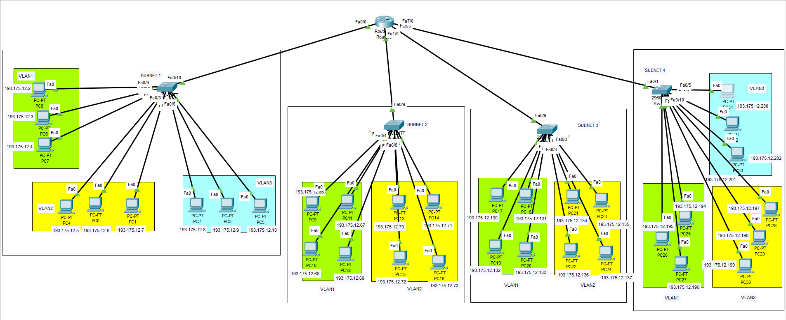

# Network Security Lab 5: VLAN Configuration and Inter-VLAN Routing

## Problem Statement

Configure a network with the following specifications:

- Use the IP address range 193.175.12.0/26
- Create 4 subnets
- Configure VLANs as follows:
  - 1st subnet: Create 3 VLANs with 9 PCs total
  - 2nd subnet: Create 2 VLANs with 8 PCs total
  - 3rd subnet: Create 2 VLANs with 8 PCs total
  - 4th subnet: Create 3 VLANs with 9 PCs total

## Subnet Calculation

1. Given IP address: 193.175.12.0/26

2. Determine the number of subnets:
   - The subnet mask /26 borrows 2 bits from the host portion of a Class C address
   - Number of subnets = 2^2 = 4 subnets

3. Calculate hosts per subnet:
   - Remaining host bits: 32 - 26 = 6 bits
   - Hosts per subnet = 2^6 - 2 = 62 usable addresses

4. Subnet ranges:
   - Subnet 1: 193.175.12.0 - 193.175.12.63
   - Subnet 2: 193.175.12.64 - 193.175.12.127
   - Subnet 3: 193.175.12.128 - 193.175.12.191
   - Subnet 4: 193.175.12.192 - 193.175.12.255

5. Usable host ranges for each subnet:
   - Subnet 1: 193.175.12.1 - 193.175.12.62
   - Subnet 2: 193.175.12.65 - 193.175.12.126
   - Subnet 3: 193.175.12.129 - 193.175.12.190
   - Subnet 4: 193.175.12.193 - 193.175.12.254

This subnetting scheme provides enough addresses for the required PCs in each subnet and allows for future growth.

## Network Setup




## IP Addressing Scheme

### Subnet 1 (Switch0)
- Router interface fa0/0: 193.175.12.1/26 (Gateway for Subnet 1)
- VLAN 10:
  - PC8: 193.175.12.2/26, Gateway: 193.175.12.1
  - PC6: 193.175.12.3/26, Gateway: 193.175.12.1
  - PC7: 193.175.12.4/26, Gateway: 193.175.12.1
- VLAN 20:
  - PC4: 193.175.12.5/26, Gateway: 193.175.12.1
  - PC0: 193.175.12.6/26, Gateway: 193.175.12.1
  - PC1: 193.175.12.7/26, Gateway: 193.175.12.1
- VLAN 30:
  - PC2: 193.175.12.8/26, Gateway: 193.175.12.1
  - PC3: 193.175.12.9/26, Gateway: 193.175.12.1
  - PC5: 193.175.12.10/26, Gateway: 193.175.12.1

### Subnet 2 (Switch1)
- Router interface fa1/0: 193.175.12.65/26 (Gateway for Subnet 2)
- VLAN 10:
  - PC9: 193.175.12.66/26, Gateway: 193.175.12.65
  - PC11: 193.175.12.67/26, Gateway: 193.175.12.65
  - PC10: 193.175.12.68/26, Gateway: 193.175.12.65
  - PC12: 193.175.12.69/26, Gateway: 193.175.12.65
- VLAN 20:
  - PC13: 193.175.12.70/26, Gateway: 193.175.12.65
  - PC14: 193.175.12.71/26, Gateway: 193.175.12.65
  - PC15: 193.175.12.72/26, Gateway: 193.175.12.65
  - PC16: 193.175.12.73/26, Gateway: 193.175.12.65

### Subnet 3 (Switch2)
- Router interface fa6/0: 193.175.12.129/26 (Gateway for Subnet 3)
- VLAN 10:
  - PC17: 193.175.12.130/26, Gateway: 193.175.12.129
  - PC18: 193.175.12.131/26, Gateway: 193.175.12.129
  - PC19: 193.175.12.132/26, Gateway: 193.175.12.129
  - PC20: 193.175.12.133/26, Gateway: 193.175.12.129
- VLAN 20:
  - PC21: 193.175.12.134/26, Gateway: 193.175.12.129
  - PC23: 193.175.12.135/26, Gateway: 193.175.12.129
  - PC22: 193.175.12.136/26, Gateway: 193.175.12.129
  - PC24: 193.175.12.137/26, Gateway: 193.175.12.129

### Subnet 4 (Switch3)
- Router interface fa7/0: 193.175.12.193/26 (Gateway for Subnet 4)
- VLAN 10:
  - PC25: 193.175.12.194/26, Gateway: 193.175.12.193
  - PC26: 193.175.12.195/26, Gateway: 193.175.12.193
  - PC27: 193.175.12.196/26, Gateway: 193.175.12.193
- VLAN 20:
  - PC28: 193.175.12.197/26, Gateway: 193.175.12.193
  - PC29: 193.175.12.198/26, Gateway: 193.175.12.193
  - PC30: 193.175.12.199/26, Gateway: 193.175.12.193
- VLAN 30:
  - PC31: 193.175.12.200/26, Gateway: 193.175.12.193
  - PC32: 193.175.12.201/26, Gateway: 193.175.12.193
  - PC33: 193.175.12.202/26, Gateway: 193.175.12.193

## Switch Configurations

### Switch0 (Subnet 1) Configuration

```
conf t
vlan 10
name VLAN10
exit
vlan 20
name VLAN20
exit
vlan 30
name VLAN30
exit

interface fa0/9
switchport mode access
switchport access vlan 10
exit
interface fa0/8
switchport mode access
switchport access vlan 10
exit
interface fa0/7
switchport mode access
switchport access vlan 10
exit
interface fa0/2
switchport mode access
switchport access vlan 20
exit
interface fa0/1
switchport mode access
switchport access vlan 20
exit
interface fa0/3
switchport mode access
switchport access vlan 20
exit
interface fa0/4
switchport mode access
switchport access vlan 30
exit
interface fa0/5
switchport mode access
switchport access vlan 30
exit
interface fa0/6
switchport mode access
switchport access vlan 30
exit
```

### Switch1 (Subnet 2) Configuration

```
conf t
vlan 10
name VLAN10
exit
vlan 20
name VLAN20
exit

interface fa0/1
switchport mode access
switchport access vlan 10
exit
interface fa0/2
switchport mode access
switchport access vlan 10
exit
interface fa0/3
switchport mode access
switchport access vlan 10
exit
interface fa0/4
switchport mode access
switchport access vlan 10
exit

interface fa0/5
switchport mode access
switchport access vlan 20
exit
interface fa0/6
switchport mode access
switchport access vlan 20
exit
interface fa0/7
switchport mode access
switchport access vlan 20
exit
interface fa0/8
switchport mode access
switchport access vlan 20
exit
```

### Switch2 (Subnet 3) Configuration

```
conf t
vlan 10
name VLAN10
exit
vlan 20
name VLAN20
exit

interface fa0/1
switchport mode access
switchport access vlan 10
exit
interface fa0/2
switchport mode access
switchport access vlan 10
exit
interface fa0/3
switchport mode access
switchport access vlan 10
exit
interface fa0/4
switchport mode access
switchport access vlan 10
exit

interface fa0/5
switchport mode access
switchport access vlan 20
exit
interface fa0/6
switchport mode access
switchport access vlan 20
exit
interface fa0/7
switchport mode access
switchport access vlan 20
exit
interface fa0/8
switchport mode access
switchport access vlan 20
exit
```

### Switch3 (Subnet 4) Configuration

```
conf t
vlan 10
name VLAN10
exit
vlan 20
name VLAN20
exit
vlan 30
name VLAN30
exit

interface fa0/2
switchport mode access
switchport access vlan 10
exit
interface fa0/3
switchport mode access
switchport access vlan 10
exit
interface fa0/4
switchport mode access
switchport access vlan 10
exit

interface fa0/10
switchport mode access
switchport access vlan 20
exit
interface fa0/9
switchport mode access
switchport access vlan 20
exit
interface fa0/8
switchport mode access
switchport access vlan 20
exit

interface fa0/7
switchport mode access
switchport access vlan 30
exit
interface fa0/6
switchport mode access
switchport access vlan 30
exit
interface fa0/5
switchport mode access
switchport access vlan 30
exit
```

## Testing

### Intra-VLAN Communication Test


### Inter-VLAN Communication Test


## Cisco Packet Tracer File
The complete network setup and configurations can be found in the attached Packet Tracer file: `Lab5_VLAN_Configuration.pkt`


## Conclusion
This lab demonstrates the successful implementation of VLANs.