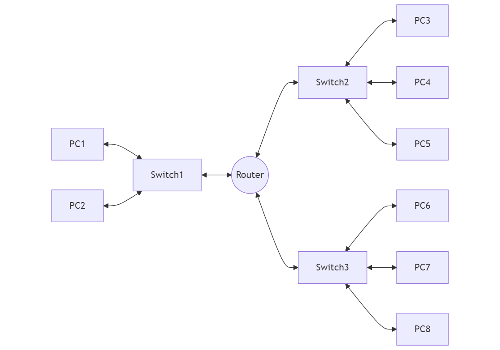
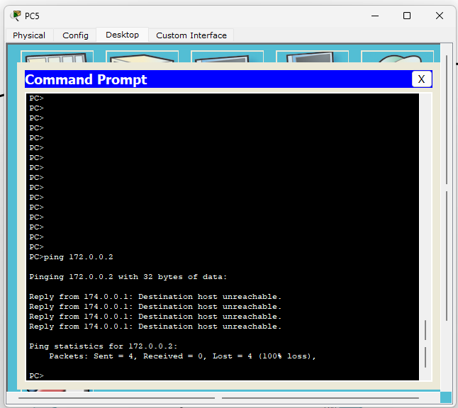
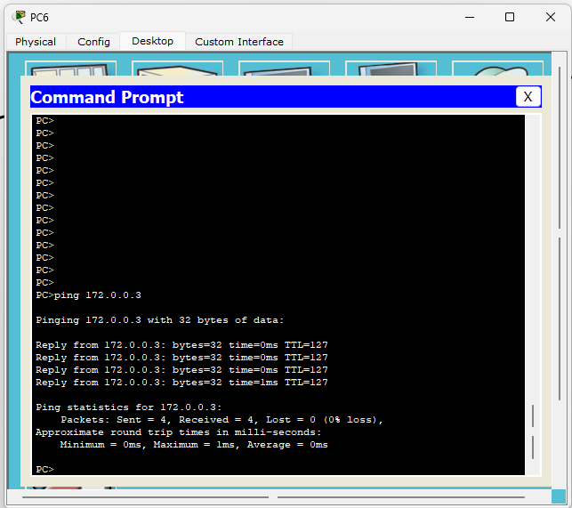
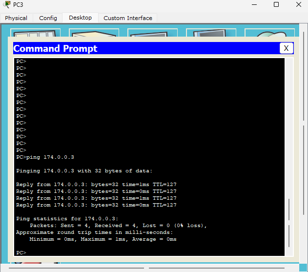
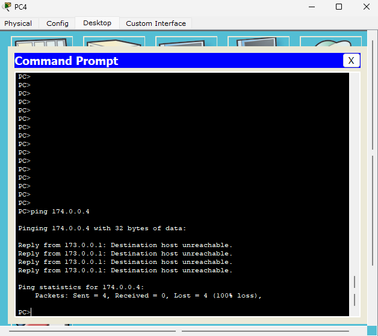
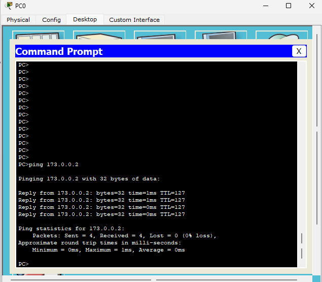
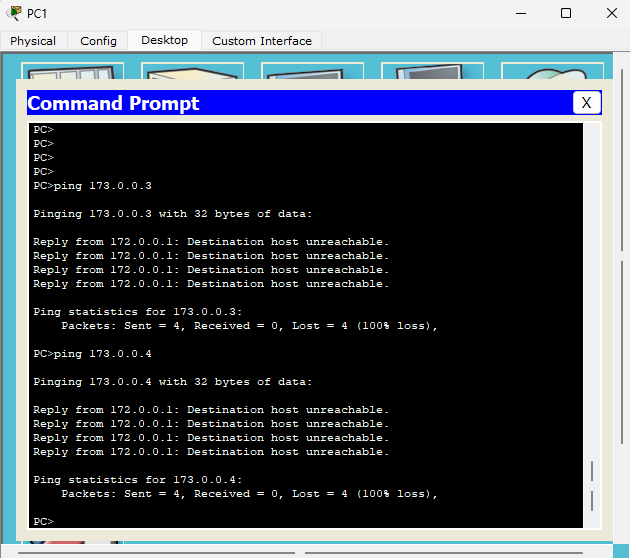
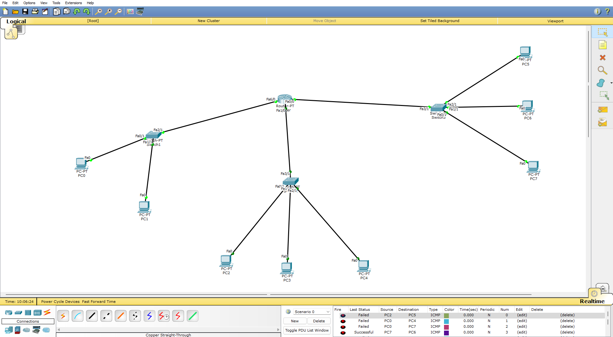

# Network Security Lab One

## Problem Statement

For this Network Security Lab, we are tasked with creating a network diagram and simulating it in Cisco Packet Tracer. The setup involves multiple networks with specific access control requirements.

### Network Diagram



### Requirements

1. Use Class B IP addresses
2. Create three separate networks:
   - Network 1 connected to Switch 1
   - Network 2 connected to Switch 2
   - Network 3 connected to Switch 3
3. Implement three Access Control Lists (ACLs) with the following rules:

   a. Traffic from Network 3 to Network 1:
      - Deny traffic to PC1
      - Permit traffic to PC2

   b. Traffic from Network 2 to Network 3:
      - Permit traffic to PC7
      - Deny traffic to PC8
      - Deny traffic to PC6

   c. Traffic from Network 1 to Network 2:
      - Permit traffic to PC3
      - Deny traffic to PC4
      - Deny traffic to PC5

### Task

1. Create the network diagram as shown above.
2. Implement the diagram in Cisco Packet Tracer.
3. Configure IP addresses using Class B.
4. Set up the required Access Control Lists.
5. Test and verify that all traffic rules are working as specified.

## Solution

### Network Setup in Cisco Packet Tracer

1. Add a generic router to the topology.
2. Configure the router's FastEthernet ports:
   - fa6/0 for Network 1
   - fa1/0 for Network 2
   - fa0/0 for Network 3
3. Add three switches to the topology.
4. Add PCs to each network:
   - Network 1: PC0, PC1
   - Network 2: PC2, PC3, PC4
   - Network 3: PC5, PC6, PC7
5. Make connections between devices:
   - Connect each switch to its respective router port
   - Connect PCs to their corresponding switches
6. Switch on the ports in the router.

### IP Configuration

#### Router Interface Configuration:
- fa6/0: 172.0.0.1/16
- fa1/0: 173.0.0.1/16
- fa0/0: 174.0.0.1/16

#### PC IP and Gateway Configuration:
1. Network 1 (172.0.0.0/16):
   - PC0: IP 172.0.0.2, Gateway 172.0.0.1
   - PC1: IP 172.0.0.3, Gateway 172.0.0.1

2. Network 2 (173.0.0.0/16):
   - PC2: IP 173.0.0.2, Gateway 173.0.0.1
   - PC3: IP 173.0.0.3, Gateway 173.0.0.1
   - PC4: IP 173.0.0.4, Gateway 173.0.0.1

3. Network 3 (174.0.0.0/16):
   - PC5: IP 174.0.0.2, Gateway 174.0.0.1
   - PC6: IP 174.0.0.3, Gateway 174.0.0.1
   - PC7: IP 174.0.0.4, Gateway 174.0.0.1

### Access Control List (ACL) Configuration

We implemented extended ACLs to meet the specified traffic control requirements:

1. For traffic from Network 3 to Network 1:

```
Router(config)#ip access-list extended FROM_NET3_TO_NET1
Router(config-ext-nacl)#deny ip 174.0.0.0 0.0.255.255 host 172.0.0.2
Router(config-ext-nacl)#permit ip 174.0.0.0 0.0.255.255 host 172.0.0.3
Router(config-ext-nacl)#permit ip any any
Router(config-ext-nacl)#exit
Router(config)#interface fa0/0
Router(config-if)#ip access-group FROM_NET3_TO_NET1 in
Router(config-if)#exit
```

2. For traffic from Network 2 to Network 3:

```
Router(config)#ip access-list extended FROM_NET2_TO_NET3
Router(config-ext-nacl)#permit ip 173.0.0.0 0.0.255.255 host 174.0.0.3
Router(config-ext-nacl)#deny ip 173.0.0.0 0.0.255.255 host 174.0.0.4
Router(config-ext-nacl)#deny ip 173.0.0.0 0.0.255.255 host 174.0.0.2
Router(config-ext-nacl)#permit ip any any
Router(config-ext-nacl)#exit
Router(config)#interface fa1/0
Router(config-if)#ip access-group FROM_NET2_TO_NET3 in
Router(config-if)#exit
```

3. For traffic from Network 1 to Network 2:

```
Router(config)#ip access-list extended FROM_NET1_TO_NET2
Router(config-ext-nacl)#permit ip 172.0.0.0 0.0.255.255 host 173.0.0.2
Router(config-ext-nacl)#deny ip 172.0.0.0 0.0.255.255 host 173.0.0.3
Router(config-ext-nacl)#deny ip 172.0.0.0 0.0.255.255 host 173.0.0.4
Router(config-ext-nacl)#permit ip any any
Router(config-ext-nacl)#exit
Router(config)#interface fa6/0
Router(config-if)#ip access-group FROM_NET1_TO_NET2 in
Router(config-if)#exit
```

### Verification and Testing

After implementing the ACLs, we tested the connectivity to ensure that the traffic rules were working as specified. The results confirmed that:

##### - Traffic from Network 3 to PC0 in Network 1 was blocked, while traffic to PC1 was permitted.




##### - Traffic from Network 2 to PC6 in Network 3 was allowed, while traffic to PC7 and PC5 was blocked.





##### - Traffic from Network 1 to PC2 in Network 2 was permitted, while traffic to PC3 and PC4 was denied.




### Packet Tracer Screenshot



### Conclusion

The network has been successfully set up in Cisco Packet Tracer with the required IP addressing scheme and Access Control Lists. All traffic rules are functioning as specified in the problem statement. This lab demonstrates the effective use of ACLs to control traffic flow between different network segments in a multi-network environment.

The complete Cisco Packet Tracer simulation file for this lab, [LabOne.pkt](./LabOne.pkt), is included in the same directory. This file contains the entire network configuration, including router settings, IP addresses, and ACLs, allowing for easy review and further experimentation with the setup.