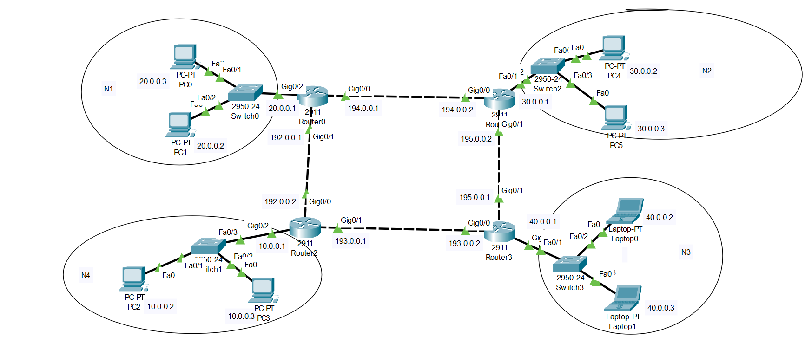

# Network Security Lab Two

## Objectives

Configure Access Control Lists (ACLs) in a multi-network environment to achieve the following:

1. For N1 => Allow traffic to N2, N3 and deny traffic to N4
2. For N2 => Allow traffic to N3 and deny traffic from N4
3. For N3 and N4 => Deny the traffic from any one specific host from N1 and N2


## Cisco Packet Tracer Setup



## IP Addressing Scheme

### Router Interfaces

#### Router0 (N1)
- GigabitEthernet0/2: 20.0.0.1/24
- GigabitEthernet0/1: 192.0.0.1/24
- GigabitEthernet0/0: 194.0.0.1/24

#### Router1 (N2)
- GigabitEthernet0/2: 30.0.0.1/24
- GigabitEthernet0/1: 195.0.0.2/24
- GigabitEthernet0/0: 194.0.0.2/24

#### Router2 (N4)
- GigabitEthernet0/2: 10.0.0.1/24
- GigabitEthernet0/1: 193.0.0.1/24
- GigabitEthernet0/0: 192.0.0.2/24

#### Router3 (N3)
- GigabitEthernet0/2: 40.0.0.1/24
- GigabitEthernet0/1: 195.0.0.1/24
- GigabitEthernet0/0: 193.0.0.2/24

### End Devices

- Network 1 (N1): 20.0.0.0/24
  - PC0: 20.0.0.3
  - PC1: 20.0.0.2
- Network 2 (N2): 30.0.0.0/24
  - PC4: 30.0.0.2
  - PC5: 30.0.0.3
- Network 3 (N3): 40.0.0.0/24
  - Laptop0: 40.0.0.2
  - Laptop1: 40.0.0.3
- Network 4 (N4): 10.0.0.0/24
  - PC2: 10.0.0.2
  - PC3: 10.0.0.3

## Access Control List (ACL) Configurations

### Router0 (N1)
```cisco
Router0>enable
Router0#configure terminal
Router0(config)#ip access-list extended N1_TRAFFIC
Router0(config-ext-nacl)#permit ip 20.0.0.0 0.0.0.255 30.0.0.0 0.0.0.255
Router0(config-ext-nacl)#permit ip 20.0.0.0 0.0.0.255 40.0.0.0 0.0.0.255
Router0(config-ext-nacl)#deny ip 20.0.0.0 0.0.0.255 10.0.0.0 0.0.0.255
Router0(config-ext-nacl)#permit ip any any
Router0(config-ext-nacl)#exit
Router0(config)#interface GigabitEthernet0/2
Router0(config-if)#ip access-group N1_TRAFFIC out
Router0(config-if)#exit
Router0(config)#interface GigabitEthernet0/0
Router0(config-if)#ip access-group N1_TRAFFIC out
Router0(config-if)#exit
Router0(config)#interface GigabitEthernet0/1
Router0(config-if)#ip access-group N1_TRAFFIC out
Router0(config-if)#exit
Router0(config)#exit
Router0#write memory
```

### Router1 (N2)
```cisco
Router1>enable
Router1#configure terminal
Router1(config)#ip access-list extended N2_TRAFFIC
Router1(config-ext-nacl)#deny ip host 30.0.0.2 40.0.0.0 0.0.0.255
Router1(config-ext-nacl)#permit ip 30.0.0.0 0.0.0.255 40.0.0.0 0.0.0.255
Router1(config-ext-nacl)#deny ip 30.0.0.0 0.0.0.255 10.0.0.0 0.0.0.255
Router1(config-ext-nacl)#permit ip any any
Router1(config-ext-nacl)#exit
Router1(config)#interface GigabitEthernet0/2
Router1(config-if)#ip access-group N2_TRAFFIC out
Router1(config-if)#exit
Router1(config)#interface GigabitEthernet0/0
Router1(config-if)#ip access-group N2_TRAFFIC out
Router1(config-if)#exit
Router1(config)#interface GigabitEthernet0/1
Router1(config-if)#ip access-group N2_TRAFFIC out
Router1(config-if)#exit
Router1(config)#exit
Router1#write memory
```

### Router3 (N3)
```cisco
Router3>enable
Router3#configure terminal
Router3(config)#ip access-list extended N3_TRAFFIC
Router3(config-ext-nacl)#deny ip host 20.0.0.2 40.0.0.0 0.0.0.255
Router3(config-ext-nacl)#deny ip host 30.0.0.2 40.0.0.0 0.0.0.255
Router3(config-ext-nacl)#permit ip any any
Router3(config-ext-nacl)#exit
Router3(config)#interface GigabitEthernet0/2
Router3(config-if)#ip access-group N3_TRAFFIC in
Router3(config-if)#exit
Router3(config)#interface GigabitEthernet0/0
Router3(config-if)#ip access-group N3_TRAFFIC in
Router3(config-if)#exit
Router3(config)#interface GigabitEthernet0/1
Router3(config-if)#ip access-group N3_TRAFFIC in
Router3(config-if)#exit
Router3(config)#exit
Router3#write memory
```

### Router2 (N4)
```cisco
Router2>enable
Router2#configure terminal
Router2(config)#ip access-list extended N4_TRAFFIC
Router2(config-ext-nacl)#deny ip host 20.0.0.2 10.0.0.0 0.0.0.255
Router2(config-ext-nacl)#deny ip host 30.0.0.2 10.0.0.0 0.0.0.255
Router2(config-ext-nacl)#permit ip any any
Router2(config-ext-nacl)#exit
Router2(config)#interface GigabitEthernet0/2
Router2(config-if)#ip access-group N4_TRAFFIC in
Router2(config-if)#exit
Router2(config)#interface GigabitEthernet0/0
Router2(config-if)#ip access-group N4_TRAFFIC in
Router2(config-if)#exit
Router2(config)#interface GigabitEthernet0/1
Router2(config-if)#ip access-group N4_TRAFFIC in
Router2(config-if)#exit
Router2(config)#exit
Router2#write memory
```


## Verification and Testing

The following ping tests were conducted to verify the ACL configurations:

### From PC0 (20.0.0.3) in N1:

```
C:\>ping 30.0.0.2

Pinging 30.0.0.2 with 32 bytes of data:

Reply from 30.0.0.2: bytes=32 time<1ms TTL=126
Reply from 30.0.0.2: bytes=32 time=10ms TTL=126
Reply from 30.0.0.2: bytes=32 time<1ms TTL=126
Reply from 30.0.0.2: bytes=32 time=1ms TTL=126

Ping statistics for 30.0.0.2:
    Packets: Sent = 4, Received = 4, Lost = 0 (0% loss),
Approximate round trip times in milli-seconds:
    Minimum = 0ms, Maximum = 10ms, Average = 2ms

C:\>ping 40.0.0.2

Pinging 40.0.0.2 with 32 bytes of data:

Reply from 40.0.0.2: bytes=32 time<1ms TTL=125
Reply from 40.0.0.2: bytes=32 time<1ms TTL=125
Reply from 40.0.0.2: bytes=32 time<1ms TTL=125
Reply from 40.0.0.2: bytes=32 time<1ms TTL=125

Ping statistics for 40.0.0.2:
    Packets: Sent = 4, Received = 4, Lost = 0 (0% loss),
Approximate round trip times in milli-seconds:
    Minimum = 0ms, Maximum = 0ms, Average = 0ms

C:\>ping 10.0.0.2

Pinging 10.0.0.2 with 32 bytes of data:

Reply from 20.0.0.1: Destination host unreachable.
Reply from 20.0.0.1: Destination host unreachable.
Reply from 20.0.0.1: Destination host unreachable.
Reply from 20.0.0.1: Destination host unreachable.

Ping statistics for 10.0.0.2:
    Packets: Sent = 4, Received = 0, Lost = 4 (100% loss),
```

### From PC1 (20.0.0.2) in N1:

```
C:\>ping 30.0.0.2

Pinging 30.0.0.2 with 32 bytes of data:

Reply from 30.0.0.2: bytes=32 time<1ms TTL=126
Reply from 30.0.0.2: bytes=32 time<1ms TTL=126
Reply from 30.0.0.2: bytes=32 time<1ms TTL=126
Reply from 30.0.0.2: bytes=32 time=2ms TTL=126

Ping statistics for 30.0.0.2:
    Packets: Sent = 4, Received = 4, Lost = 0 (0% loss),
Approximate round trip times in milli-seconds:
    Minimum = 0ms, Maximum = 2ms, Average = 0ms

C:\>ping 40.0.0.2

Pinging 40.0.0.2 with 32 bytes of data:

Reply from 195.0.0.1: Destination host unreachable.
Reply from 193.0.0.2: Destination host unreachable.
Reply from 195.0.0.1: Destination host unreachable.
Reply from 193.0.0.2: Destination host unreachable.

Ping statistics for 40.0.0.2:
    Packets: Sent = 4, Received = 0, Lost = 4 (100% loss),

C:\>ping 10.0.0.2

Pinging 10.0.0.2 with 32 bytes of data:

Reply from 20.0.0.1: Destination host unreachable.
Reply from 20.0.0.1: Destination host unreachable.
Reply from 20.0.0.1: Destination host unreachable.
Reply from 20.0.0.1: Destination host unreachable.

Ping statistics for 10.0.0.2:
    Packets: Sent = 4, Received = 0, Lost = 4 (100% loss),
```

### From PC4 (30.0.0.2) in N2:

```
C:\>ping 40.0.0.2

Pinging 40.0.0.2 with 32 bytes of data:

Reply from 30.0.0.1: Destination host unreachable.
Reply from 30.0.0.1: Destination host unreachable.
Reply from 30.0.0.1: Destination host unreachable.
Reply from 30.0.0.1: Destination host unreachable.

Ping statistics for 40.0.0.2:
Packets: Sent = 4, Received = 0, Lost = 4 (100% loss),

C:\>ping 10.0.0.2

Pinging 10.0.0.2 with 32 bytes of data:

Reply from 30.0.0.1: Destination host unreachable.
Reply from 30.0.0.1: Destination host unreachable.
Reply from 30.0.0.1: Destination host unreachable.
Reply from 30.0.0.1: Destination host unreachable.

Ping statistics for 10.0.0.2:
Packets: Sent = 4, Received = 0, Lost = 4 (100% loss),
```

### From PC5 (30.0.0.3) in N2:

```
C:\>ping 40.0.0.2

Pinging 40.0.0.2 with 32 bytes of data:

Reply from 40.0.0.2: bytes=32 time<1ms TTL=126
Reply from 40.0.0.2: bytes=32 time=29ms TTL=126
Reply from 40.0.0.2: bytes=32 time<1ms TTL=126
Reply from 40.0.0.2: bytes=32 time<1ms TTL=126

Ping statistics for 40.0.0.2:
    Packets: Sent = 4, Received = 4, Lost = 0 (0% loss),
Approximate round trip times in milli-seconds:
    Minimum = 0ms, Maximum = 29ms, Average = 7ms

C:\>ping 10.0.0.2

Pinging 10.0.0.2 with 32 bytes of data:

Reply from 30.0.0.1: Destination host unreachable.
Reply from 30.0.0.1: Destination host unreachable.
Reply from 30.0.0.1: Destination host unreachable.
Reply from 30.0.0.1: Destination host unreachable.

Ping statistics for 10.0.0.2:
    Packets: Sent = 4, Received = 0, Lost = 4 (100% loss),
```

### From Laptop0 (40.0.0.2) in N3:

```
C:\>ping 20.0.0.2

Pinging 20.0.0.2 with 32 bytes of data:

Request timed out.
Request timed out.
Request timed out.
Request timed out.

Ping statistics for 20.0.0.2:
Packets: Sent = 4, Received = 0, Lost = 4 (100% loss),

C:\>ping 20.0.0.3

Pinging 20.0.0.3 with 32 bytes of data:

Reply from 20.0.0.3: bytes=32 time=12ms TTL=125
Reply from 20.0.0.3: bytes=32 time=1ms TTL=125
Reply from 20.0.0.3: bytes=32 time<1ms TTL=125
Reply from 20.0.0.3: bytes=32 time<1ms TTL=125

Ping statistics for 20.0.0.3:
Packets: Sent = 4, Received = 4, Lost = 0 (0% loss),
Approximate round trip times in milli-seconds:
Minimum = 0ms, Maximum = 12ms, Average = 3ms

C:\>ping 30.0.0.2

Pinging 30.0.0.2 with 32 bytes of data:

Request timed out.
Request timed out.
Request timed out.
Request timed out.

Ping statistics for 30.0.0.2:
Packets: Sent = 4, Received = 0, Lost = 4 (100% loss),

C:\>ping 30.0.0.3

Pinging 30.0.0.3 with 32 bytes of data:

Reply from 30.0.0.3: bytes=32 time<1ms TTL=126
Reply from 30.0.0.3: bytes=32 time<1ms TTL=126
Reply from 30.0.0.3: bytes=32 time<1ms TTL=126
Reply from 30.0.0.3: bytes=32 time<1ms TTL=126

Ping statistics for 30.0.0.3:
Packets: Sent = 4, Received = 4, Lost = 0 (0% loss),
Approximate round trip times in milli-seconds:
Minimum = 0ms, Maximum = 0ms, Average = 0ms
```

### From PC2 (10.0.0.2) in N4:

```
C:\>ping 20.0.0.2

Pinging 20.0.0.2 with 32 bytes of data:

Request timed out.
Request timed out.
Request timed out.
Request timed out.

Ping statistics for 20.0.0.2:
Packets: Sent = 4, Received = 0, Lost = 4 (100% loss),

C:\>ping 20.0.0.3

Pinging 20.0.0.3 with 32 bytes of data:

Request timed out.
Request timed out.
Request timed out.
Request timed out.

Ping statistics for 20.0.0.3:
Packets: Sent = 4, Received = 0, Lost = 4 (100% loss),

C:\>ping 30.0.0.2

Pinging 30.0.0.2 with 32 bytes of data:

Request timed out.
Request timed out.
Request timed out.
Request timed out.

Ping statistics for 30.0.0.2:
Packets: Sent = 4, Received = 0, Lost = 4 (100% loss),

C:\>ping 30.0.0.3

Pinging 30.0.0.3 with 32 bytes of data:

Request timed out.
Request timed out.
Request timed out.
Request timed out.

Ping statistics for 30.0.0.3:
Packets: Sent = 4, Received = 0, Lost = 4 (100% loss),

C:\>ping 40.0.0.2

Pinging 40.0.0.2 with 32 bytes of data:

Reply from 40.0.0.2: bytes=32 time<1ms TTL=126
Reply from 40.0.0.2: bytes=32 time<1ms TTL=126
Reply from 40.0.0.2: bytes=32 time<1ms TTL=126
Reply from 40.0.0.2: bytes=32 time<1ms TTL=126

Ping statistics for 40.0.0.2:
Packets: Sent = 4, Received = 4, Lost = 0 (0% loss),
Approximate round trip times in milli-seconds:
Minimum = 0ms, Maximum = 0ms, Average = 0ms

C:\>ping 40.0.0.3

Pinging 40.0.0.3 with 32 bytes of data:

Reply from 40.0.0.3: bytes=32 time<1ms TTL=126
Reply from 40.0.0.3: bytes=32 time<1ms TTL=126
Reply from 40.0.0.3: bytes=32 time<1ms TTL=126
Reply from 40.0.0.3: bytes=32 time=11ms TTL=126

Ping statistics for 40.0.0.3:
Packets: Sent = 4, Received = 4, Lost = 0 (0% loss),
Approximate round trip times in milli-seconds:
Minimum = 0ms, Maximum = 11ms, Average = 2ms
```

## Conclusion

Based on the ping test results, we can conclude that the implemented ACLs have successfully met the objectives:

1. For N1 (20.0.0.0/24):
   - Traffic is allowed to N2 and N3 as intended.
   - Traffic is denied to N4 as required.
   - The specific host 20.0.0.2 is blocked from accessing N3, while 20.0.0.3 can reach N3.

2. For N2 (30.0.0.0/24):
   - Traffic is allowed to N3 from hosts other than 30.0.0.2.
   - Traffic is denied to N4 as required.
   - The specific host 30.0.0.2 is blocked from accessing N3, while 30.0.0.3 can reach N3.

3. For N3 (40.0.0.0/24):
   - Traffic from specific hosts 20.0.0.2 (N1) and 30.0.0.2 (N2) is denied.
   - Traffic from other hosts in N1 and N2 is allowed.

4. For N4 (10.0.0.0/24):
   - Traffic is denied from N1 and N2.
   - Traffic is allowed to and from N3.

These results demonstrate that the ACLs are effectively controlling traffic flow according to the specified requirements. The configuration successfully implements selective access between networks while blocking specific hosts as needed.
